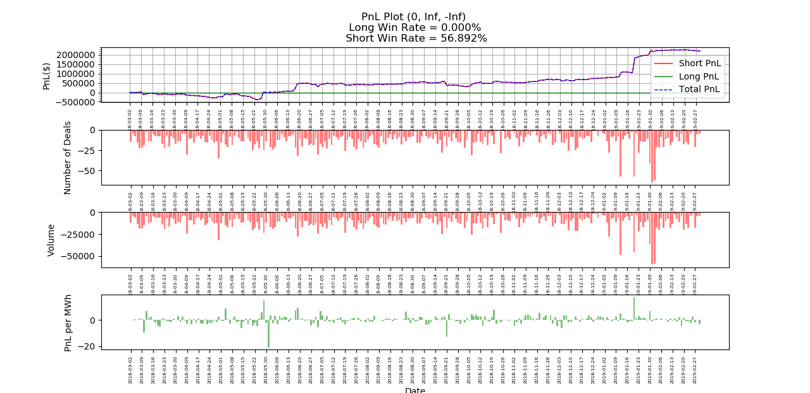
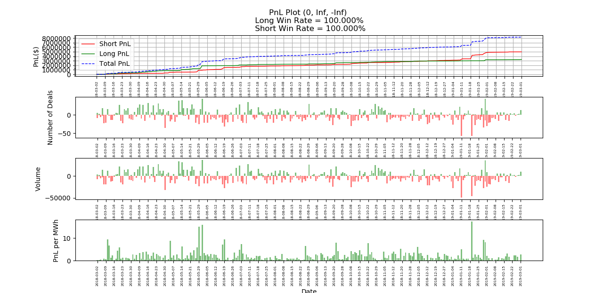

## BackTest Result (PDA)

#### Parameter
1. **Threshold**
   * Actual bid price = dalmp(predicted) - margin
   * Actual offer price =  dalmp(predicted) + margin

2. **Long short ratio**: defined as (max long volume) / (max short volume)
3. **Volume limitation**
4. **Prediction method**
    * Dayzer hourly
    * Dayzer daily
    * Dayzer daily adjusted
    * Like Hour(TODO)
---
### Extreme Situation

#### All short

#### All long

#### Trade with settled DALMP

---
### Dayzer Performance

#### Threshold = 0, (-inf,inf), Dayzer Daily Prediction

#### Threshold = 0, (-inf,inf), Dayzer Daily Adjusted Prediction

##### Big win detail

##### Big loss detail

---
### Like-Hour Performance

---

### Ensembling

#### Linear ensembling

#### ML ensembling(TODO)

