## Dayzer Prediction Evaluation
#### Dayzer Predcition Error (2018-08-24 to 2019-05-15)
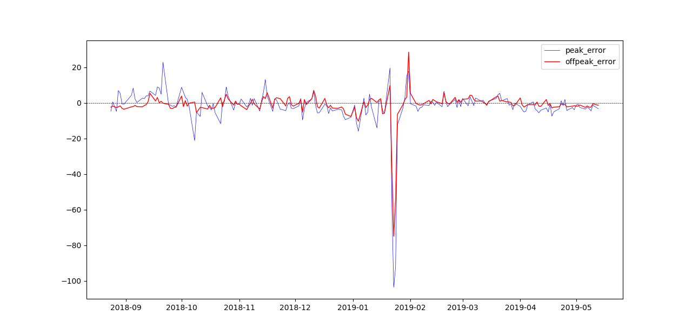

* extreme value : 2019-01-23
* dayzer was adjusted on: 
    * 2019-03-17
    * 2019-04-11
    * 2019-05-13
#### Boxplot of hourly prediction change
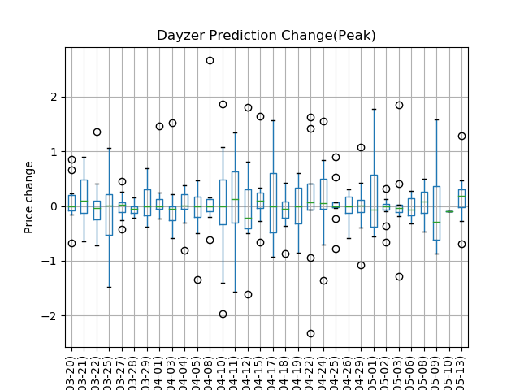

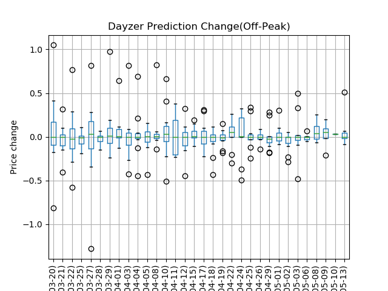
* CI for box: 5% ~ 95%
* Change on peak hour is more volatile, as expected

#### Histogram of error (DALMP - DALMP_PRED)

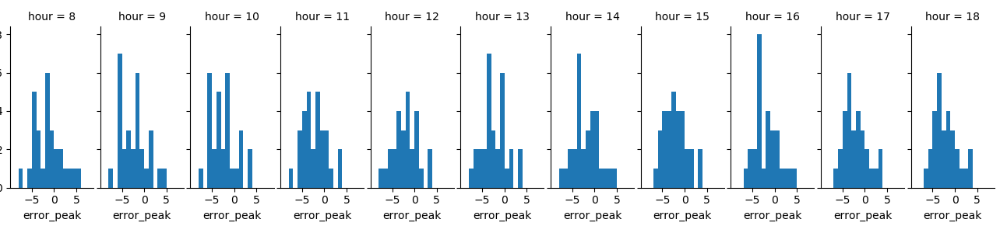

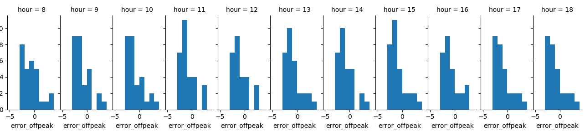

* For both peak and off-peak, Dayzer tends to **under-estimate** the DALMP
* The "closer" prediction is more accurate

#### Residual Analysis

Regression Actual ~ Prediction 

##### regression summary
Peak
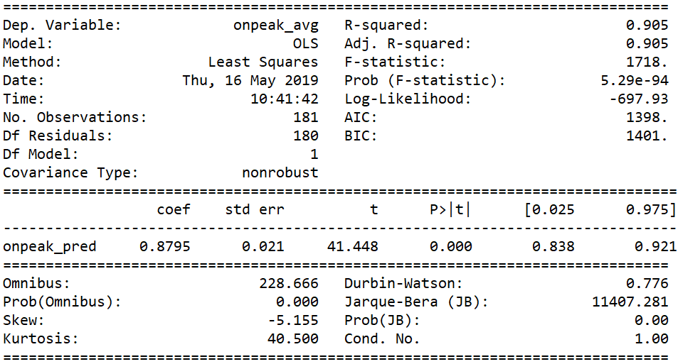

Off-peak
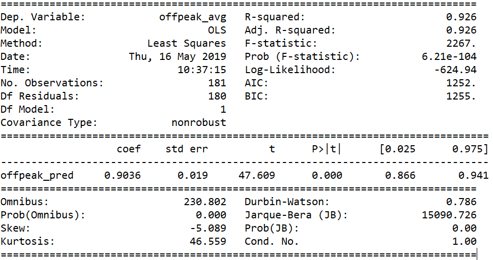

##### QQ-Plot

Peak 
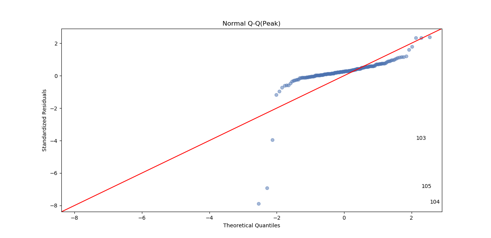

Off-peak
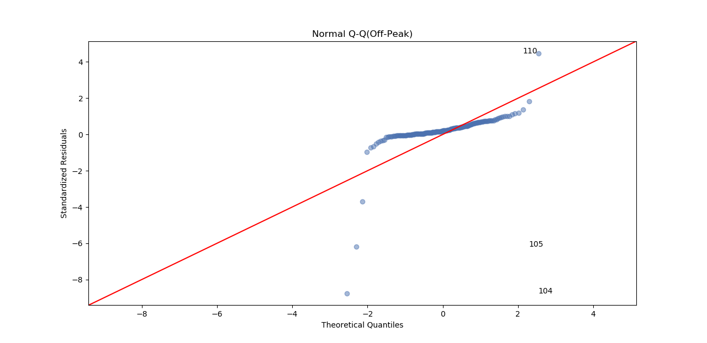

* None of them follow normal distribution

##### Residual ~ Fitted Value

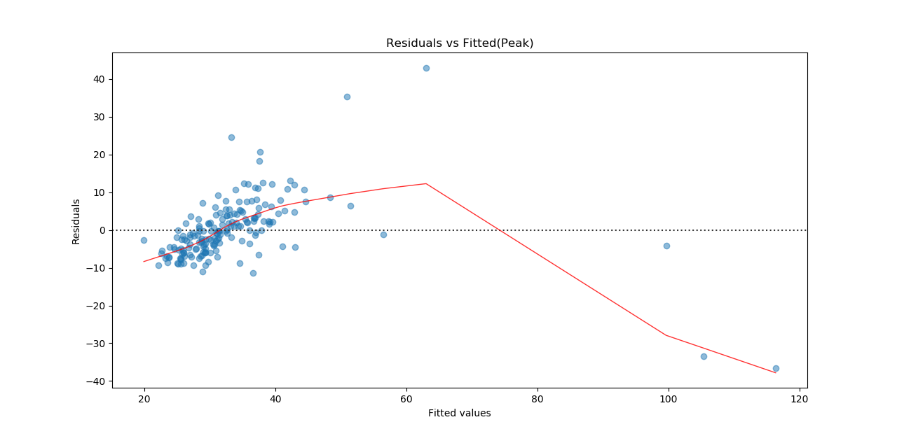

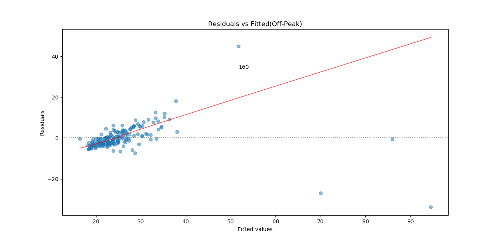

